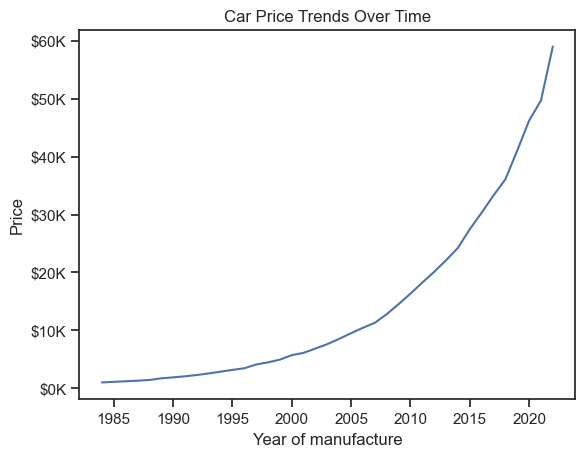
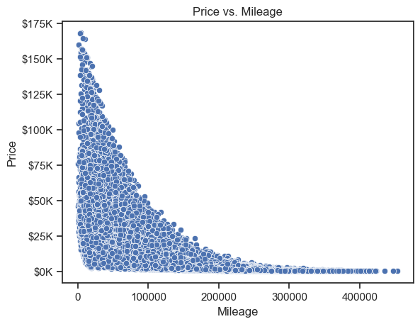
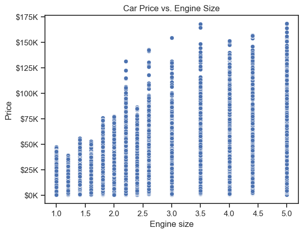
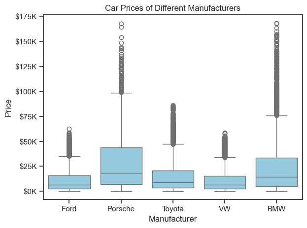
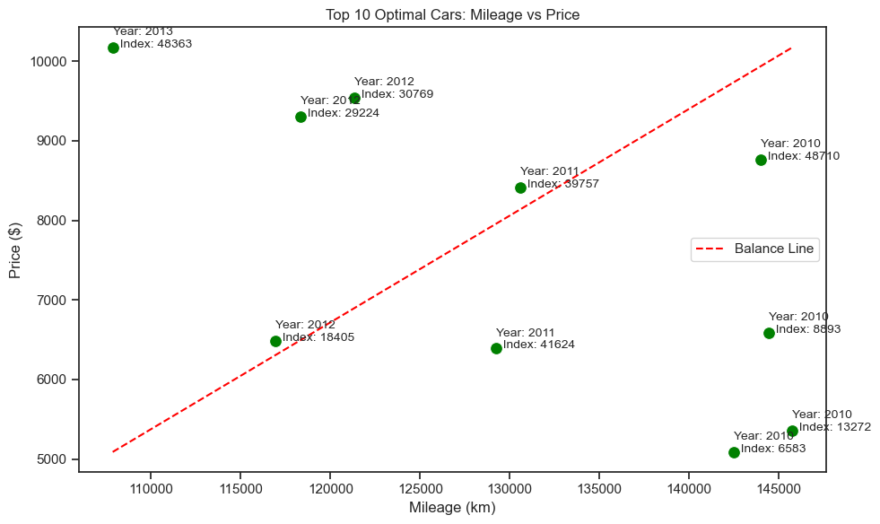

# 🚗 Second-Hand Car Sales Analysis

## 📊 Project Overview
This project explores the dynamics of the second-hand car market, analyzing trends, pricing patterns, and factors influencing vehicle sales. Through data cleaning, exploratory analysis, and visualizations, it provides insights into the used car market.

## 🔧 Technologies Used
- **Programming Language:** Python
- **Libraries:** Pandas, NumPy, Matplotlib, Seaborn
- **Data Source:** https://www.kaggle.com/datasets/msnbehdani/mock-dataset-of-second-hand-car-sales

## 🔍 Key Insights
- **Price Distribution:** How car prices vary across different makes, models, and years.
- **Mileage Impact:** Relationship between mileage and pricing.
- **Condition Analysis:** Effect of vehicle condition on resale value.
- **Geographical Trends:** Regional variations in car prices and demand.

## 📈 Visualizations
### Year vs. Price
  

### Price vs. Mileage
  

### Price vs. Engine Size
  

### Price vs. Manufacturer
  

### Top 10 Most Optimal Cars to Buy
  

The 2 most optimal cars depending on Price and Mileage :
| Manufacturer | Model   | Engine size | Fuel type | Year of manufacture | Mileage | Price  |
|--------------|---------|-------------|-----------|-------------------|---------|--------|
| Ford         | Fiesta	 | 1.0    | Petrol    | 2012              | 116,953	  | 6486$ |
| VW       |Golf  | 1.6       | Petrol    | 2011	              | 130,607  | 8410$ |

## 🚀 How to Run the Project
1. Clone the repository:
    ```bash
    git clone https://github.com/AminaZa/ds_projects/tree/main/second_hand_car_sales
    ```
2. Navigate to the project directory:
    ```bash
    cd second_hand_car_sales
    ```
3. Install dependencies:
    ```bash
    pip install -r requirements.txt
    ```
4. Run the analysis script:
    ```bash
    python analysis.py
    ```

## 📄 License
This project is licensed under the **MIT License**.  
You are free to use, copy, modify, and distribute this project, as long as you give proper credit.  

Full license text: [MIT License](https://opensource.org/licenses/MIT)

## 🔗 Check It Out
Full project code: [GitHub Repository](https://github.com/AminaZa/ds_projects/tree/main/second_hand_car_sales)